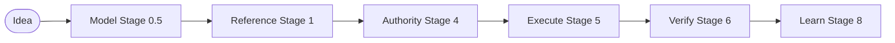

# Alan Coding Dark Factory (ACDF) v8

## An AI Engineering Operating System for Governed Software Development

Alan Coding Dark Factory (ACDF) is an autonomous, sequential, and gate-governed AI engineering operating system. ACDF does not compile code in a vacuum; it acts as a deterministic execution container that enforces architectural constraints, content-hashed snapshots, and continuous learning feedback loops.



---

## 1. Why Now? The Bottleneck Has Shifted

Generative AI has commoditized code synthesis. Modern frontier models can now generate code faster than humans can verify it. 

As a result, the bottleneck in software development has fundamentally shifted:
* **The scarce resource is no longer tokens**; it is **engineering judgment, verification, and runtime truth**.
* Without strict boundaries, AI coding assistants introduce hidden regression risks, structural drift, and spec hallucinations.
* Relying purely on natural language prompts leads to inconsistent codebase architectures and repeated bugs.

ACDF exists because the engineering bottleneck has changed. ACDF separates the **reasoning prior** (the expert knowledge) from the **operating protocol** (the gated container), ensuring that AI agents operate safely within whitelisted boundaries.

---

## 2. Hero Lenses: Evolving Engineering Doctrines

The flagship innovation of ACDF is the **Hero Lens**—a living engineering knowledge module synthesized from curated expert engineering corpora. 

A Hero Lens is **not** a prompt persona, and it is **not** role-playing. It is a structured engineering doctrine.

```text
Books, Talks, Podcasts, Conference presentations, Interviews, Papers, Tweets, GitHub discussions
                                       │
                                       ▼
                                  NotebookLM
                                       │
                                       ▼
                              Knowledge Extraction
                                       │
                                       ▼
                              Engineering Doctrine
                                       │
                                       ▼
                                  Checklists
                                       │
                                       ▼
                              Evidence Requirements
                                       │
                                       ▼
                              Execution Constraints
                                       │
                                       ▼
                                   Hero Lens
```

### The Ingestion Pipeline
Each lens is backed by its own maintained NotebookLM corpus of an expert's published work. As technical practices, database designs, or security patterns evolve, the NotebookLM is updated. The Hero Lens doctrine improves over time without modifying the underlying ACDF operating system.

### Stage 3 Model Challenge
Lenses are used in Stage 3 (Adversarial Review) to challenge system designs, sequence limits, and database boundaries:
* **Lopopolo (Harness Master)**: Challenges AST constraints, compile loops, and enforces sub-minute test cycles.
* **Cherny (Type-Driven Orchestrator)**: Challenges interface types, options layouts, and checklist decomposition.
* **Willison (Agentic Architect)**: Challenges API integration mockings and pushes forcontained Docker sandboxes.
* **Hashimoto (Hammer Maker)**: Challenges developer environments, scripting usability, and setup scripts.
* **Taylor (Product Machine Builder)**: Assures user outcomes and prevents agent reward-hacking (e.g. deleting test lines).
* **Carlini (Adversarial Reductionist)**: Challenges data boundaries, prompt inputs, and security trust zones.
* **Schaad (Temporal Craftsman)**: Assures UI state coverage (Loading, Empty, Success, Warning, Error, Recovery).
* **Wood (Protocol Primitive Architect)**: Challenges multi-actor transaction constraints and invariant logic.
* **Karpathy (Micro-Loop Engineer)**: Enforces surgical code changes and minimal diff statistics.
* **Carmack (Runtime Truth Engineer)**: Assures runtime metrics, console trace outputs, and burn-in testing.

---

## 3. Multi-Model Orchestration (Approximate MoE Workflow)

ACDF intentionally orchestrates multiple frontier models to perform different engineering roles:
* **High-Reasoning Models**: Allocated to planning, task decomposition, and sequence modeling.
* **Critique Models**: Allocated to adversarial reviews and design validation.
* **Fast-Inference Coding Models**: Allocated to Stage 5 implementation.
* **Deterministic Compiler/Test Engines**: Validate binary gates.

This orchestrator pipeline approximates many of the practical workflow benefits of a **Mixture-of-Experts (MoE) engineering process** without requiring custom model training, distributed model inference, or expensive custom serving infrastructure.

---

## 4. Human-in-the-Loop Governance

ACDF does not aim for complete, unguided autonomy. It enforces a strict division of responsibility:

> **Humans govern. Agents execute.**

Today, these critical tasks remain deliberate human responsibilities:
1. **Curating Ingestion Sources**: Selecting which expert literature, papers, or codebase reviews populate a Hero Lens.
2. **Arbitrating Conflicts**: Aligning systems when adversarial reviews flag architectural contradictions.
3. **Defining Correctness**: Stating the project's success criteria and active trust zones.
4. **Sealing Authority**: Reviewing and signing off on Stage 4 `authority.json` snapshots.
5. **Evaluating Tradeoffs**: Deciding when to accept code debt or architectural compromises.

---

## 5. Model-First Engineering (Stage 0.5)

ACDF operates on a strict model-first philosophy:

```
Idea ──► Mental Models (Stage 0.5) ──► Specifications (Stage 1) ──► Execution (Stage 5)
```

Mermaid diagrams are not documentation; they are **executable mental models** that drive specifications, authority, and task board dependencies. 

Every non-trivial change must generate:
* **Flowcharts**: Mapping decision paths.
* **Sequence Diagrams**: Mapping API request-response and data boundaries.
* **State Machines**: Mapping valid states and transition gates.

No code implementation is allowed until these diagrams are verified and locked.

---

## 6. What Makes ACDF Different

Here is where ACDF fits compared to prompt engineering and specification frameworks:

| Feature / Dimension | Prompt Engineering | Spec-Driven Frameworks | GitHub Spec Kit | ACDF v8 |
|---|---|---|---|---|
| **Primary Focus** | Text instructions | Spec agreement | Spec validation | **Execution governance** |
| **Workflow Model** | Fluid | Fluid | Linear / Waterfall | **Sequential & Gated** |
| **Knowledge Engine** | Static prompts | None | None | **Evolving Hero Lenses** |
| **Ingestion Pipeline** | Manual | None | None | **NotebookLM Corpora** |
| **Write Constraints** | None | Directory-wide | Branch-wide | **Content-Hashed snaps** |
| **System Modeling** | Optional | Optional | Optional | **Stage 0.5 Mermaid Models** |
| **Verification Gate** | None | Optional | Mandatory | **Binary Gates & Smoke Reports** |
| **Orchestration** | Single Model | Single Model | Single Model | **Multi-Model Orchestrator** |
| **Organizational Learning**| Lost in logs | None | None | **Retro Spec Invariant Sync** |

---

## 7. The 11 Lifecycle Stages

Every codebase modification walks a strict sequential path:

* **Stage 0: Intent Capture** — Guides user briefs and JTBD interviews.
* **Stage 0.5: Architectural Modeling** — Generates executable Mermaid diagrams.
* **Stage 1: Reference Guide** — Asserts interfaces, schemas, and the "Ten No's" list.
* **Stage 2: Change Setup** — Scaffolds change folders and maps task boards.
* **Stage 3: Adversarial Review** — Challenges models and designs via Hero Lenses.
* **Stage 4: Snapshot Lock** — Creates a content-hashed state verification check.
* **Stage 5: Claim & Build** — Claims tasks and writes code inside bounded loops.
* **Stage 6: Verify Gate** — Asserts compiler correctness and unit test success.
* **Stage 6.5: Smoke Test** — Executes E2E pathways in headless browser environments.
* **Stage 7: Stabilization** — Compiles cold-start project runbooks.
* **Stage 8: Retrospective** — Feeds back learning cards to update reference guidelines.

---

## 8. Long-Term Vision

By separating **Knowledge** (which evolves via NotebookLM updates) from **Protocol** (which remains locked in the kernel), ACDF future-proofs autonomous development. 

As frontier models improve, manual orchestration steps may shrink, but the core operating system boundaries, content-hashed snapshots, and sequential gates remain stable, establishing ACDF as a robust engineering operating system for AI-driven software development.
