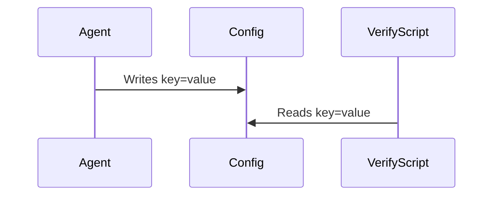

# Technical Design: Tiny Change

- **Architecture Type**: Configuration Update
- **Reference Contract Referenced**: Mock Specification

---

## 1. System Components & Interfaces

The system reads parameters from `config.txt` inside the local environment.

---

## 2. Execution Sequence

