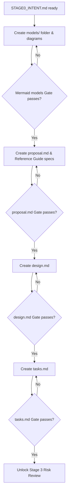

# ACDF v8 Change — Stage 2 Scoped Change Structure

This document governs the layout, creation, and sequential validation of **Stage 2 (Change Setup & Task Board)**.

In ACDF v8, all development tasks are contained within a dedicated change directory: `.acdf/changes/<change-id>/`. Unlike fluid layouts, ACDF change folder structures are **strictly sequential and gate-locked**. You cannot start building until planning and modeling artifacts are completed and locked.

---

## 1. Scoped Change Folder Layout

Every active change must maintain the following file structure:

```text
.acdf/changes/<change-id>/
├── models/                 # Stage 0.5: Architectural models (flow, sequence, ER, C4, etc.)
├── proposal.md             # Stage 2: Intent, out-of-scope non-goals, rollback procedure
├── design.md               # Stage 2: Interfaces, algorithms, schemas, and diagrams
├── tasks.md                # Stage 2: Task board checklist with allowed write zones and gates
├── risk_review.md          # Stage 3: Risk lens evaluation, critique logs, and register
├── authority.json          # Stage 4: Locked content-hashed snapshot of specs & graph
├── BUILD_LEDGER.md         # Stage 5: Append-only implementation history & blockers
├── claims/                 # Stage 5: Agent task claim lockfiles
├── state-log.ndjson        # Stage 5: NDJSON log auditing claim/release/complete events
├── evidence/               # Stage 6: Console outputs, compile logs, test runner files
├── receipts/               # Stage 6: Machine-readable JSON receipts per completed task
└── retrospective.md        # Stage 8: Learning cards and Reference Guide updates
```

---

## 2. Sequential Gate Progression (Gated Planning & Modeling)

The change-scoped artifacts must be built and validated in a strict topological order. An agent may not proceed to task decomposition until the system architectures are modeled in Stage 0.5.



---

## 3. Modeling Stage Gate Requirements

Before decomposing tasks, the agent must generate appropriate Mermaid diagrams under `.acdf/changes/<change-id>/models/`. These are not optional documentation. They are executable mental models that drive the build.

### 3.1 Model Categories
1. **Flowcharts**: Define system flow transitions and decision branches.
2. **Sequence Diagrams**: Map microservice messages, API request-response loops, and thread bounds.
3. **State Diagrams**: Define valid states, lifecycle events, and invalid transition boundaries.
4. **ER Diagrams**: Map database entities, relationships, database constraints, and fields.
5. **C4 Containers**: Structure larger decoupling bounds across deployment servers.
