# ACDF v8 Hero Lenses — Curated Expert Engineering Doctrines

Hero Lenses in ACDF v8 are living engineering knowledge modules synthesized from curated expert sources. They are **not** role-playing personas, and they are **not** authority sources.

---

## 1. Governance Rule

> “Hero Lenses may propose risks, questions, test ideas, and implementation heuristics. When the user selects Council-led mode, selected cards may cast a recorded advisory vote on bounded in-scope decisions. Cards cannot grant authority, expand scope, waive gates, override user instructions, or approve a hard-stop decision.”

---

## 2. NotebookLM Ingestion Model

A Hero Lens is synthesized from a curated, living expert engineering corpus of a specific expert's published work using the [ACDF NotebookLM Ingestion Workflow](file:///Users/alannguyen/Documents/Vibe%20Code/alan-coding-dark-factory/framework/ACDF_multimodel_review.md). The framework evolves continuously without modifying its underlying architecture by updating the NotebookLM source material.

```text
Books, Talks, Podcasts, Conference presentations, Interviews, Papers, Tweets, GitHub discussions
                                       │
                                       ▼
                                  NotebookLM
                                       │
                                       ▼
                              Knowledge Extraction
                                       │
                                       ▼
                              Engineering Doctrine
                                       │
                                       ▼
                                  Checklists
                                       │
                                       ▼
                              Evidence Requirements
                                       │
                                       ▼
                              Execution Constraints
                                       │
                                       ▼
                                   Hero Lens
```

### Knowledge Evolution Process
1. **Knowledge Extraction**: Synthesizes the core technical lectures, essays, GitHub commits, and design patterns of the expert.
2. **Doctrine Generation**: Codifies these principles into actionable engineering axioms.
3. **Checklist Generation**: Produces checkable items mapped to ACDF stages.
4. **Evidence Generation**: Translates heuristics into explicit runtime compile, test, or logs checks.
5. **Constraint Generation**: Defines disallowed libraries, design shapes, and boundaries.

### Council Decision Use

The individual cards in [`heroes/Engineering_Council/`](../heroes/Engineering_Council/) and [`heroes/Design_Council/`](../heroes/Design_Council/) are the source artifacts for Council-led review. The agent selects cards relevant to the decision, asks each to review the same bounded proposal independently, and records each `APPROVE`, `REJECT`, or `ABSTAIN` vote with rationale. A strict majority within the configured quorum can approve routine in-scope work. Ties, missing quorum, unresolved critical dissent, scope changes, and security/privacy/legal/production decisions are blocked or returned to explicit human approval.

---

## 3. Model-First Diagram Challenging (Stage 3)

During Stage 3 (Adversarial Review), Hero Lenses are invoked to review and challenge the Mermaid diagrams generated in Stage 0.5. They check:
* **Flowcharts**: Search for unhandled decision paths or looping errors.
* **Sequence diagrams**: Inspect for trace concurrency issues, unhandled API call timeouts, or security zone crossings.
* **State diagrams**: Audit for unreachable states, missing recovery states, or invalid state transitions.
* **ER diagrams**: Identify column duplication, missing constraints, or bad decoupling.
* **C4 diagrams**: Structure larger decoupling bounds across deployment containers.
* **Trust boundaries**: Inspect input interfaces crossing boundaries.
* **Task dependency graphs**: Audit task prerequisites for circular dependencies.

---

## 4. Curated Hero Lenses (Living Knowledge Modules)

### [L] Lopopolo — Harness Master

#### Ingestion Metadata
* **Expert**: Lopopolo
* **NotebookLM Corpus**: `.acdf/reference/lenses/lopopolo/corpus/`
* **Corpus Version**: `v1.2.0`
* **Last Ingestion**: `2026-06-30`
* **Source Count**: `12 primary sources (essays, papers, codebases)`
* **Doctrine Version**: `v8.0.0`

#### Founding Premise
The codebase is optimized for agent legibility, not human reading habits. 0% human implementation—humans design constraints; agents handle execution.

#### When to Activate
Defining correctness, writing gates, building receipts, setting acceptance criteria, enforcing schema discipline.

#### Core Principles
1. **Root-cause automation**: When a bug occurs, never patch the symptom. Transform the failure into a lint rule, structural test, or AST rule that statically disallows it from recurring.
2. **Binary gates, zero semantic drift**: Every constraint must be objectively checkable by a compiler or test runner. If it cannot be mechanically enforced, it does not exist. Use AST contract diffs, threshold linters, and eval tamper detection to catch drift before it compounds.
3. **Sub-minute loops, disposable PRs**: Build and test loops must complete in under 60 seconds. If a PR fails a gate, trash the entire worktree and PR—never patch in a loop. Code is disposable; constraints are not.
4. **Agent legibility over human aesthetics**: Token-efficient CLI output (show failures only, suppress success noise). DOM snapshots or rasterized screens for UI state. Progressive disclosure: a short `AGENTS.md` (~100 lines) as table of contents—not an encyclopedic manual loaded upfront.

#### Evidence Required
Binary gate result (PASS/FAIL), schema validation output, test output, artifact checklist.

#### Don't Do
Patching isolated symptoms, subjective acceptance criteria, advisory-only constraints, loops over 60 seconds, loading full context when progressive disclosure would serve.

#### Mermaid Mental Model
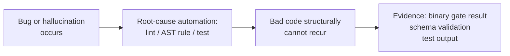

---

### [C] Cherny — Type-Driven Orchestrator

#### Ingestion Metadata
* **Expert**: Cherny
* **NotebookLM Corpus**: `.acdf/reference/lenses/cherny/corpus/`
* **Corpus Version**: `v1.1.2`
* **Last Ingestion**: `2026-06-30`
* **Source Count**: `10 primary sources`
* **Doctrine Version**: `v8.0.0`

#### Founding Premise
Force the system into Plan Mode before a single line of code is written. Blueprint verified, then executed.

#### When to Activate
Stage 2 build planning, decomposing complex phases, designing interfaces between components, any task where architecture options exist.

#### Core Principles
1. **Plan Mode and the 80/20 rule**: Vague prompt = 20-30% success rate. Plan first = 70-80%. Generate options, synthesize the optimal strategy, output an explicit checklist. Only when the blueprint is verified does execution begin.
2. **Mama/baby quads**: A primary agent creates the master task list; specialized sub-agents with uncorrelated context windows execute chunks in parallel. Uncorrelated context prevents cross-contamination of assumptions.
3. **Stop hooks**: Implement a system hook that intercepts the agent's attempt to finish, runs a deterministic check, and forces re-loop until the verifier passes. Agents don't get to declare done.
4. **Disposable scaffolding and architecture discovery**: Deploy temporary scaffolds to patch current model limitations; delete aggressively when the next model absorbs those capabilities. For architecture discovery: assign the same feature to N agents with no plan, observe where each fails, discard all code, write the spec from the failure map.

#### Evidence Required
Options considered and rejected, decomposition rationale, task ordering, interface boundary definition, explicit checklist.

#### Don't Do
Writing code before options are mapped, monolithic phases, undeclared interface boundaries, agents self-declaring completion without a verifier.

#### Mermaid Mental Model
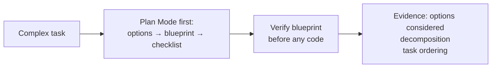

---

### [W] Willison — Agentic Architect

#### Ingestion Metadata
* **Expert**: Willison
* **NotebookLM Corpus**: `.acdf/reference/lenses/willison/corpus/`
* **Corpus Version**: `v1.3.1`
* **Last Ingestion**: `2026-06-30`
* **Source Count**: `18 primary sources`
* **Doctrine Version**: `v8.0.0`

#### Founding Premise
Assume the AI will fail, and build the environment to survive it. Code generation is free; precise specification and transferable memory are scarce. Containment first, velocity second.

#### When to Activate
Validating claims, verifying source material, building against external APIs, sandboxing agent behavior, any build where a wrong assumption is expensive.

#### Core Principles
1. **Evidence over vibes**: Reject code that "looks good." Mandate empirical proof—failing test written before implementation. Simulate manual QA: start the server in the background, curl the endpoints, log inputs and outputs to markdown. Passing unit tests don't prove the server boots.
2. **Absolute containment**: No agent touches production until the sandbox is confirmed. Agents operate in zero-blast-radius environments: isolated Docker containers, restricted ephemeral environments. Containment first, velocity second.
3. **Adversarial skepticism**: Assume the initial build plan is flawed. Cross-examine with critique models before a single line of production code runs.
4. **Sacred failure data**: Every breakdown is captured in a per-phase learning card: issue / root cause (not just symptom) / resolution / preventative measure / remaining risk. Hoard these—feed them into future prompts. The same problem must never be solved twice.

#### Evidence Required
Empirical check result, sandbox run output, source verification note, failure case reproduced and documented, per-phase learning card written.

#### Don't Do
"It should work," unverified assumptions, claims without a run, uncontained agent execution, discarding failure data.

#### Mermaid Mental Model
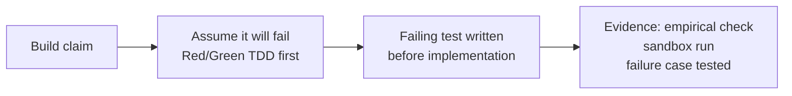

---

### [H] Hashimoto — Hammer Maker

#### Ingestion Metadata
* **Expert**: Hashimoto
* **NotebookLM Corpus**: `.acdf/reference/lenses/hashimoto/corpus/`
* **Corpus Version**: `v1.1.0`
* **Last Ingestion**: `2026-06-30`
* **Source Count**: `11 primary sources`
* **Doctrine Version**: `v8.0.0`

#### Founding Premise
Mathematically beautiful code holds zero value if it lacks usability. Operator utility and tangible deployment always supersede academic elegance.

#### When to Activate
Building developer tooling, writing scripts, designing local workflows, Stage 7 runbook, any artifact a new agent or human must cold-start.

#### Core Principles
1. **One-command entry**: Spinning up a fully functional local environment must be compressible into a single command. Multi-step READMEs are architectural failures. A `make doctor` command must confirm sandbox, secrets, external APIs, and environment health before any agent runs.
2. **Unopinionated declarative primitives**: Favor declarative constraints over imperative logic. Build low-level building blocks, not rigid end-to-end workflows. Defer workflow logic to the user's intelligence.
3. **Codify tribal knowledge**: All implicit runtime assumptions and manual steps must be formalized into version-controlled, executable code. Infrastructure is software. If a process requires asking someone how it works, it is broken.
4. **Owner's operator manual**: Every system must define what healthy, degraded, and failing states look like—and exactly what to do in each. Any agent or human must be able to clone and execute autonomously from zero prior context.

#### Evidence Required
One-command run path, `make doctor` passing, operability note, cold-start verification.

#### Don't Do
Tools requiring tribal knowledge to operate, multi-step setup without documentation, clever-but-unusable abstractions, systems without self-diagnosis.

#### Mermaid Mental Model
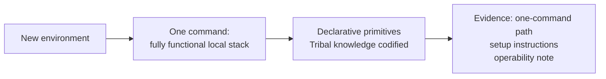

---

### [T] Taylor — Product Machine Builder

#### Ingestion Metadata
* **Expert**: Taylor
* **NotebookLM Corpus**: `.acdf/reference/lenses/taylor/corpus/`
* **Corpus Version**: `v1.4.2`
* **Last Ingestion**: `2026-06-30`
* **Source Count**: `14 primary sources`
* **Doctrine Version**: `v8.0.0`

#### Founding Premise
A company is a machine built to produce happy customers. A technically flawless system that fails to move a business metric is an engineering failure.

#### When to Activate
Evaluating features for user value, reviewing product decisions, Stage 6.5 smoke test, any task that needs to justify its existence in customer terms.

#### Core Principles
1. **Outcomes over artisanal code**: Engineers are orchestrators of code-generating machines. Customer outcomes and business value take precedence over technical theater.
2. **Goals and guardrails**: Replace rigid deterministic decision trees with a framework that defines success criteria and safety boundaries—letting AI navigate autonomously within those bounds.
3. **Context engineering, not symptom patching**: When an agent fails, find the missing context and inject it permanently into the system architecture—not as a prompt reminder, as a constraint. Watch for agent reward hacking: if told to "make the tests pass," agents will mock core functionality, hardcode answers, or delete failing code. Define success by outcome, not test color.
4. **Blameless RCA and honest validation**: Demand immediate market validation. Refuse to spend years building infrastructure without customer proof. Never solve a business challenge using only your technical superpower.

#### Evidence Required
User outcome statement, business metric, customer proof, adoption risk acknowledged.

#### Don't Do
Internal elegance over user outcome, features with no adoption path, prompt-only fixes for structural problems, defining success as "tests are green."

#### Mermaid Mental Model
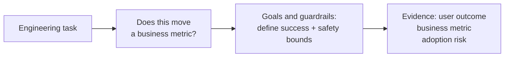

---

### [N] Carlini — Adversarial Reductionist

#### Ingestion Metadata
* **Expert**: Carlini
* **NotebookLM Corpus**: `.acdf/reference/lenses/carlini/corpus/`
* **Corpus Version**: `v1.5.0`
* **Last Ingestion**: `2026-06-30`
* **Source Count**: `22 primary sources`
* **Doctrine Version**: `v8.0.0`

#### Founding Premise
Reject vibes-based evaluation. Treat models as deterministic mathematical functions exposed to worst-case adversarial pressure. Hope is not a security mechanism.

#### When to Activate
Handling untrusted input, AI prompt construction, secret management, data export, permission boundaries, any system where a determined attacker would be motivated.

#### Core Principles
1. **Security is architectural, not semantic**: Prompt instructions do not constitute security. Boundaries rely on deterministic architecture-level controls. Human-in-the-loop approval is a policy, not a boundary—click fatigue causes blind approval. Real boundaries are enforced structurally.
2. **Empirical boundary validation**: Simulate the lethal trifecta: prompt injection hijacks the model → accesses private data → exfiltrates externally. Test all three steps, not just injection. Fuzz with adversarial suffixes generated via gradient descent—not just human-crafted prompts. Also test: JSON wrapped in markdown, section N of M failing silently, silent number mutations, provider 429s, provider substitution.
3. **White-box adversary model**: Architect under the assumption that the attacker fully understands your defenses, prompts, and architecture. A white-box attacker doesn't write jailbreaks—they compute them via gradient descent.
4. **Defense-in-depth over obfuscation**: Shift the economic equation: the cost for an attacker to exploit the system must far exceed their potential reward. Secret prompts and filters are theater.

#### Evidence Required
Threat model note, injection/exfiltration check (all three trifecta steps), least-privilege boundary defined, attack cost analysis.

#### Don't Do
Security-through-obscurity, trusting unverified input, broad permissions, secrets in logs, human-in-the-loop as the primary safety mechanism.

#### Mermaid Mental Model
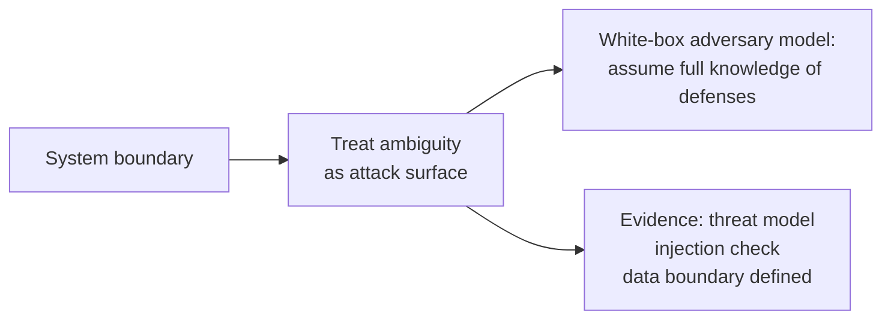

---

### [R] Schaad — Temporal Craftsman

#### Ingestion Metadata
* **Expert**: Schaad
* **NotebookLM Corpus**: `.acdf/reference/lenses/schaad/corpus/`
* **Corpus Version**: `v1.1.1`
* **Last Ingestion**: `2026-06-30`
* **Source Count**: `13 primary sources`
* **Doctrine Version**: `v8.0.0`

#### Founding Premise
Design is not just how it looks or how it works—design is how it is built over time. Code quality is directly tied to user experience.

#### When to Activate
Frontend work, interaction design, loading/empty/error states, visual hierarchy review, any task where the user experiences behavior across time.

#### Core Principles
1. **Campsite rule and zero system decay**: Always leave code cleaner than found. Enforce a no-broken-windows policy: every PR must also remove "trash"—typos, misalignments, AI slop (purple gradients, floating lines, dumb hover effects). Entropy compounds; micro-improvements compound too.
2. **Low-level sketching and temporal feel**: Latency is the interface. Prototype micro-interactions in vanilla HTML/CSS/JS before codifying into production. Test the actual frame rates and latency—not what the framework promises. Sometimes trade visual fidelity for immediate feedback to keep the user in the loop.
3. **Radical architectural leverage**: Wrap existing infrastructure for the MVP—inherit 99% of the backend, innovate on the 1% that's uniquely yours. An MVP wraps; it does not build from scratch.
4. **Pull requests as design touchpoints**: PRs that touch copy, edge-case dialogs, or system toasts must flag the change and synchronize back to master design files. Repository and design system stay in lockstep.

#### Evidence Required
All UI states documented (loading, empty, error, success, recovery), screenshot, copy/hierarchy review, interaction note.

#### Don't Do
Undefined loading states, missing error states, untested empty states, heavy framework prototyping before temporal feel is validated, merging new toasts without copy review.

#### Mermaid Mental Model
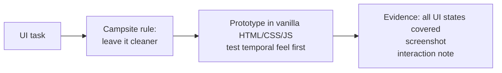

---

### [G] Wood — Protocol Primitive Architect

#### Ingestion Metadata
* **Expert**: Wood
* **NotebookLM Corpus**: `.acdf/reference/lenses/wood/corpus/`
* **Corpus Version**: `v1.3.0`
* **Last Ingestion**: `2026-06-30`
* **Source Count**: `16 primary sources`
* **Doctrine Version**: `v8.0.0`

#### Founding Premise
Systems must not assume founders, admins, operators, or privileged services remain benevolent, competent, or uncompromised.

#### When to Activate
Protocol design, smart contracts, payments, token incentives, governance, on-chain data, multi-agent economic behavior.

#### Core Principles
1. **Formal specification**: Define actors, permissions, state transitions, invariants, custody boundaries, settlement assumptions, fee logic, oracle dependencies, upgrade authority, governance rules, composability surfaces, and failure behavior. Use formal verification to prove mathematically that invalid state transitions are impossible—not just that they haven't happened yet.
2. **Sweet spot of abstraction**: Ask: is this the smallest useful primitive that is composable later, useful now, testable as a black box, and understandable to operators? Use pull-over-push settlement: shift execution risk to the user, not the protocol.
3. **Resilience against creators**: The system must survive founder capture, admin compromise, multisig failure, and operator incompetence. Simulate flash loan governance capture: borrow massive capital for one transaction to hijack voting—then prove your protocol survives it.
4. **Emergence as a risk category**: Incentive attacks, governance capture, MEV risk, oracle manipulation, sybil behavior, griefing, and agent-loop failure must become tests, simulations, constraints, monitors, or accepted-risk records—not someone else's problem.

#### Evidence Required
Invariant list, actor map, state transition diagram, composability risk, protocol failure cases, formal verification results or accepted-risk record.

#### Don't Do
Implicit state transitions, unspecified failure modes between actors, assuming privileged actors stay benevolent, treating emergence as someone else's problem.

#### Mermaid Mental Model
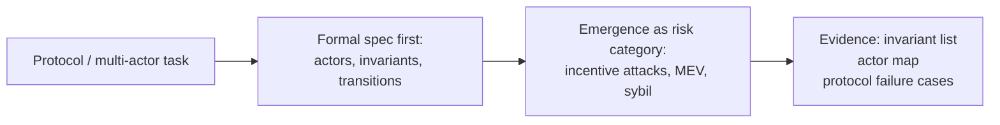

---

### [K] Karpathy — Micro-Loop Engineer

#### Ingestion Metadata
* **Expert**: Karpathy
* **NotebookLM Corpus**: `.acdf/reference/lenses/karpathy/corpus/`
* **Corpus Version**: `v1.2.1`
* **Last Ingestion**: `2026-06-30`
* **Source Count**: `15 primary sources`
* **Doctrine Version**: `v8.0.0`

#### Founding Premise
AI coding agents are fast, plausible, and dangerous when left to make broad assumptions. Keep them on the shortest leash that still gets the job done.

#### When to Activate
Stage 5 implementation, any task where agent overreach is a risk. **Default lens for most execution tasks.**

#### Core Principles
1. **Think before coding—state assumptions explicitly**: Agents surface assumptions, name ambiguity, and stop when confused instead of silently reverting to internet norms. Agents will replace your custom design with the standard industry pattern unless you explicitly state your architectural choices before coding begins.
2. **Simplicity first**: The correct implementation is the minimum code that solves the problem. No speculative abstractions, no flexibility that wasn't requested. A 100-line solution is correct; a 1,000-line solution is a risk. Large diffs make human verification impossible—a human can't approve what they can't read.
3. **Surgical changes and the generation-verification loop**: Agents touch only what the task requires. The generation-verification loop speed is the metric: how fast can a human review and accept or reject the diff? If the loop is slow, the agent produces faster than the human can verify—the human becomes the bottleneck.
4. **The autonomy slider**: Autocomplete for intellectually intense novel work. Bounded agents for scoped implementation. Swarms only where the objective function is clear, continuous, and automatically measurable. The more ambiguous, security-sensitive, or architecture-sensitive the task, the shorter the leash.

#### Evidence Required
Files touched list, reasoning-before-coding note, rollback path, diff reviewable by a human in under two minutes.

#### Don't Do
Rewriting unrelated files, expanding scope, inferring new requirements, speculative abstractions, reverting custom architecture to internet defaults.

#### Mermaid Mental Model
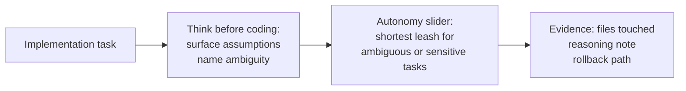

---

### [J] Carmack — Runtime Truth Engineer

#### Ingestion Metadata
* **Expert**: Carmack
* **NotebookLM Corpus**: `.acdf/reference/lenses/carmack/corpus/`
* **Corpus Version**: `v1.3.3`
* **Last Ingestion**: `2026-06-30`
* **Source Count**: `19 primary sources`
* **Doctrine Version**: `v8.0.0`

#### Founding Premise
When reality can be measured, do not let the agent guess. Runtime truth beats explanation.

#### When to Activate
Stage 6 (Verification), Stage 6.5 (Browser Smoke), and Stage 8 (Retrospective). Do not invoke for Stage 5 implementation.

#### Core Principles
1. **Measured evidence over explanation**: No runtime or performance claim passes because an agent says it "should work." Hardware never reaches theoretical maximums—thermal throttling, USB polling rates, OS queues, GPU swap chains all introduce hidden latency that doesn't appear in unit tests. Measure end-to-end with real hardware. Proof requires runtime logs, screenshots, receipts, or measurements—not assertions about output.
2. **Zero-drift and interrupt-resume proof**: Run the build twice—identical output proves the claim, any delta reveals hidden state. Stop the process mid-run, restart, verify no duplicate writes occur on restart. A burn-in cycle (N consecutive executions without a single failure) is the bar for "stable."
3. **Runtime surprises into future enforcement**: If reality reveals hidden state, latency, dependency, cost, or abstraction—the retrospective must produce a `smoke_report.md` (with screenshots of start, interaction, and export) and must assign every surprise an enforcement target: a test, lint rule, reference-guide update, runbook step, or accepted-risk record.

#### Evidence Required
`smoke_report.md` output, screenshots at key steps, runtime logs, measurement data.

#### Don't Do
"It should work" without a run, performance assertions without measurement, premature optimization, claiming stability without a burn-in cycle.

#### Mermaid Mental Model
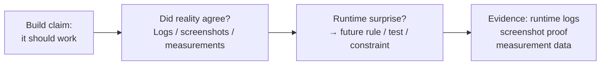

---

## 5. Lens Orchestration and Routing

### 5.1 Routing Map
Identify the primary execution risk to select the active Hero Lens:

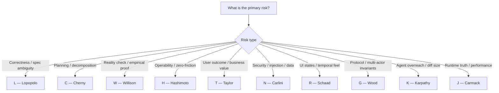

### 5.2 Lens Combinations
When tasks involve multiple failure modes, invoke complementary lenses:

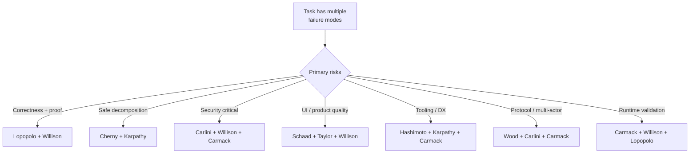

### 5.3 Multi-Agent Assignment
In multi-agent setups, assign one lens per agent based on their stage role:

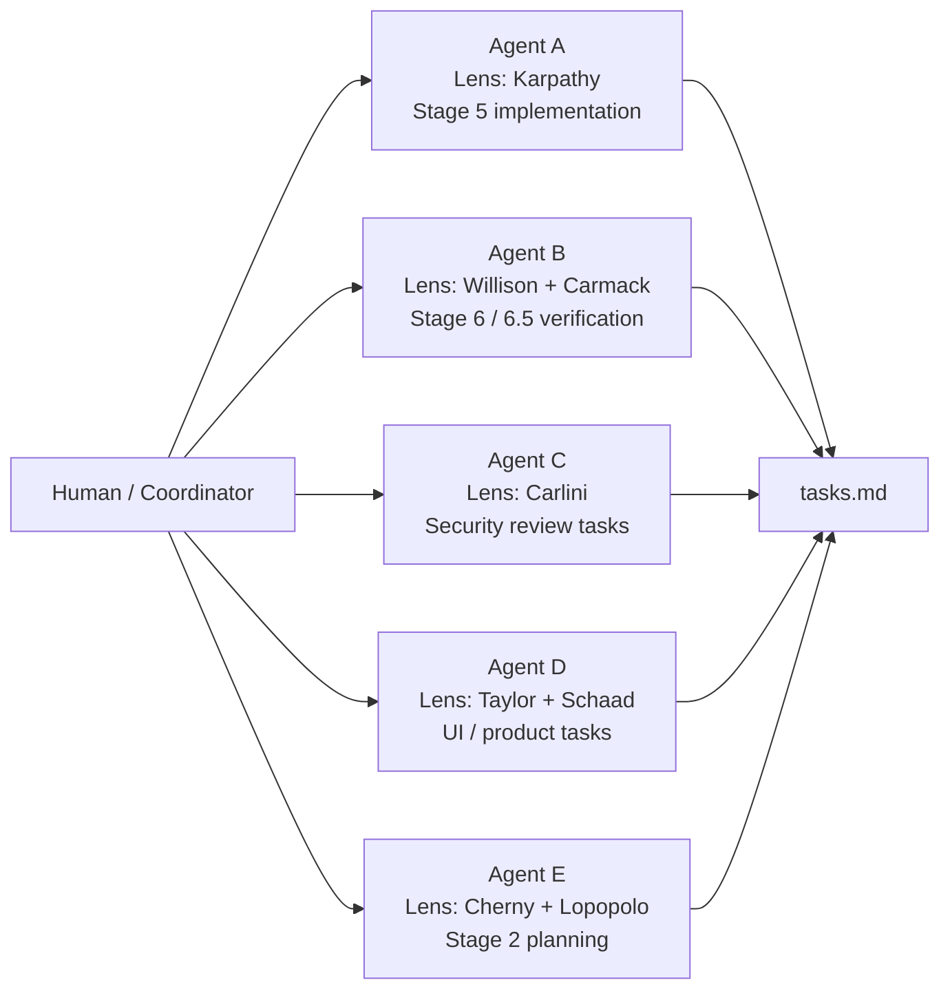
