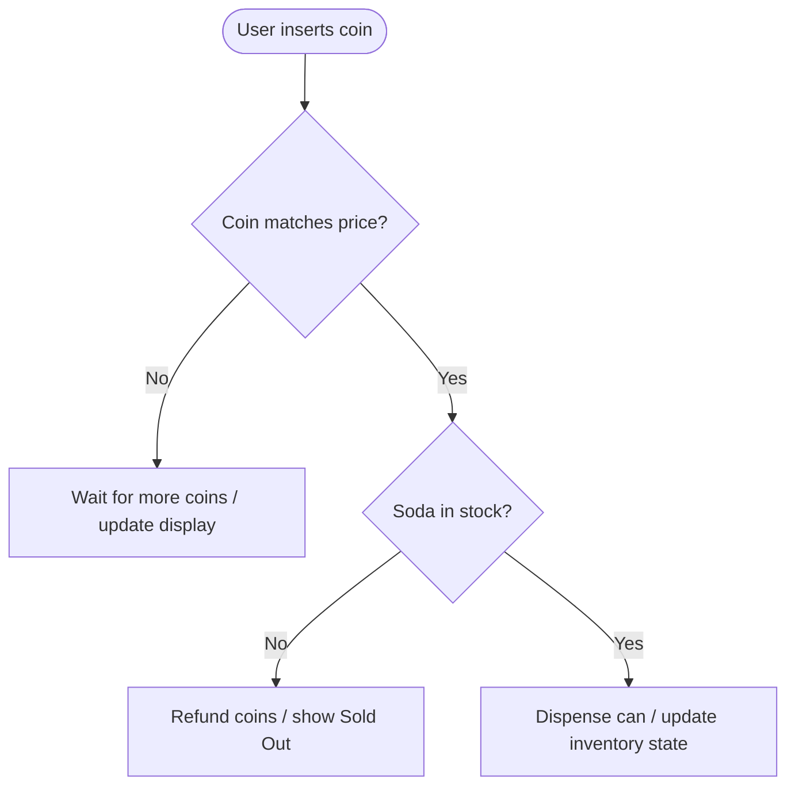

# Lesson 1: What is Software?

## 1. The Big Picture

Think of a simple vending machine. You walk up to it, insert a coin, press a button for a soda, and the machine drops a cold can. 

This vending machine is running software, even if it is built out of metal gears. It does not think. It follows a simple recipe:
* It takes an **input** (your coin and button press).
* It checks its current **state** (does it have sodas left? how much money was inserted?).
* It applies **logic** (if the coin is equal to the price, release the can).
* It produces an **output** (drops the soda can, updates the display state).

All software, from a simple calculator to a massive social network, is just a vending machine scaled up to handle millions of inputs and state changes.

---

## 2. The Mental Model

Picture software as a **black box** with an input funnel, a storage room (state), and an output tray.

```text
  Inputs (Funnel) ──► [ LOGIC BOX (Updates Storage/State) ] ──► Outputs (Tray)
```

* **Inputs**: Data fed into the box (keystrokes, mouse clicks, temperature readings).
* **State (Storage)**: What the box remembers about the past (items in a cart, user logged in).
* **Logic**: Rules that determine what to do with the input and state.
* **Outputs**: The visible result (pixels on a screen, database updates).

---

## 3. Visual Thinking

Let's look at the vending machine's logic flowchart:



This diagram maps the path. By tracing the arrows, you can predict exactly how the machine behaves under any condition.

---

## 4. Build Something: The Kitchen Recipe Spec

For your first project, you will write a specification for a kitchen microwave oven.
1. Create a plain text file named `microwave_spec.txt`.
2. Write down:
   - **Inputs**: What buttons can the user press?
   - **State**: What does the microwave need to remember? (e.g. time remaining, door open/closed).
   - **Logic**: What happens when the "Start" button is pressed while the door is open? What if the door is closed?
   - **Outputs**: What does the microwave do? (e.g. turn on light, start magnetron, beep 3 times).

---

## 5. Hero Lens Reflection

How would different engineering perspectives audit our microwave recipe?
* **Karpathy (Micro-Loop)**: Is the specification simple? Can we strip out unnecessary features (like popcorn button presets) to make the code easier to write?
* **Carmack (Runtime Truth)**: How do we measure if the microwave is actually heating? What console logs should the system emit when the door sensor trips?
* **Carlini (Security Red-Team)**: Can a user bypass the safety lock? What happens if the door sensor fails while the microwave is active? How do we verify the boundaries?

---

## 6. Reflection Questions

1. Why does the microwave need to remember state (door open/closed)? What happens if we delete that state component?
2. How would you verify that your microwave logic actually works in a real kitchen without causing a fire?
3. What is the difference between an input and a state parameter?
