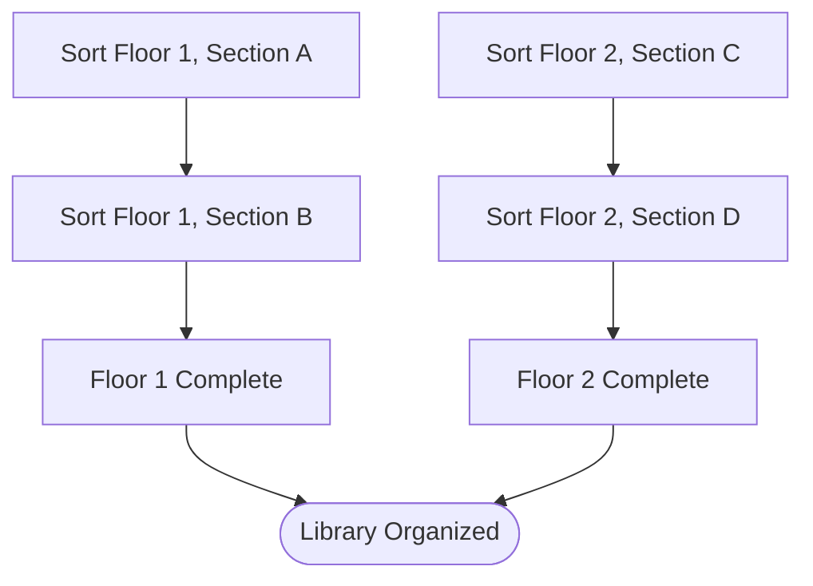

# Lesson 2: How Engineers Think

## 1. The Big Picture

Imagine you are tasked with cleaning a massive, cluttered three-story library. If you walk in, look at the thousands of scattered books, and try to organize them all at once, you will quickly become overwhelmed and quit.

An engineer looks at this library and does not see a single massive problem. They see a system of smaller, manageable tasks:
1. Divide the library by floors.
2. Divide each floor by genre sections (fiction, science, history).
3. Establish a standard shelf placement rule (alphabetical by author).
4. Build a checklist: "Clean Floor 1, Section A" -> "Clean Floor 1, Section B".

By breaking a large, terrifying problem into tiny, step-by-step tasks, you can solve anything. This process is called **Decomposition**.

---

## 2. The Mental Model: The Decomposition Tree

Every massive task can be split into sub-tasks. We visualize this as an inverted tree:

```text
                        [ Organize Library ]
                                 │
         ┌───────────────────────┴───────────────────────┐
         ▼                                               ▼
[ Sort Floor 1 ]                                 [ Sort Floor 2 ]
         │                                               │
 ┌───────┴───────┐                               ┌───────┴───────┐
 ▼               ▼                               ▼               ▼
[Section A]     [Section B]                     [Section C]     [Section D]
```

To complete the root task, you must walk the leaf tasks from bottom to top. You never build the root first.

---

## 3. Visual Thinking

Let's look at how task dependencies are mapped using a flowchart:



The arrows show dependencies: Floor 1 is not "Complete" until both Section A and Section B are done. 

---

## 4. Build Something: Task Board Decomposition

You want to build a feature: "Users can register an account, log in, and see a welcome message."
1. Create a file named `task_decomposition.txt`.
2. Decompose this feature into at least 4 individual sub-tasks.
3. For each sub-task, define:
   - What must be done *before* starting this task? (Dependencies)
   - What is the binary proof (how do you know it is done)?
   - Example: Task 1: "Create database users table." Dependency: None. Proof: Table exists in DB.

---

## 5. Hero Lens Reflection

How would different engineering doctrines review our task board?
* **Cherny (Type-Driven Orchestrator)**: Are the boundaries between tasks clean? Does Task 2 rely on type interfaces defined in Task 1? Are there circular dependencies?
* **Lopopolo (AST & Harness)**: Can we write an automated script to verify the proof for each task? Or are we relying on human check-offs?
* **Willison (Empirical Skeptic)**: How do we sandbox the database task so we don't pollute active developer workspaces?

---

## 6. Reflection Questions

1. What happens if you start implementation on a task before its dependencies are complete?
2. How does writing down a task's binary proof prevent you from writing unnecessary code?
3. What was the hardest part about breaking down the login feature?
