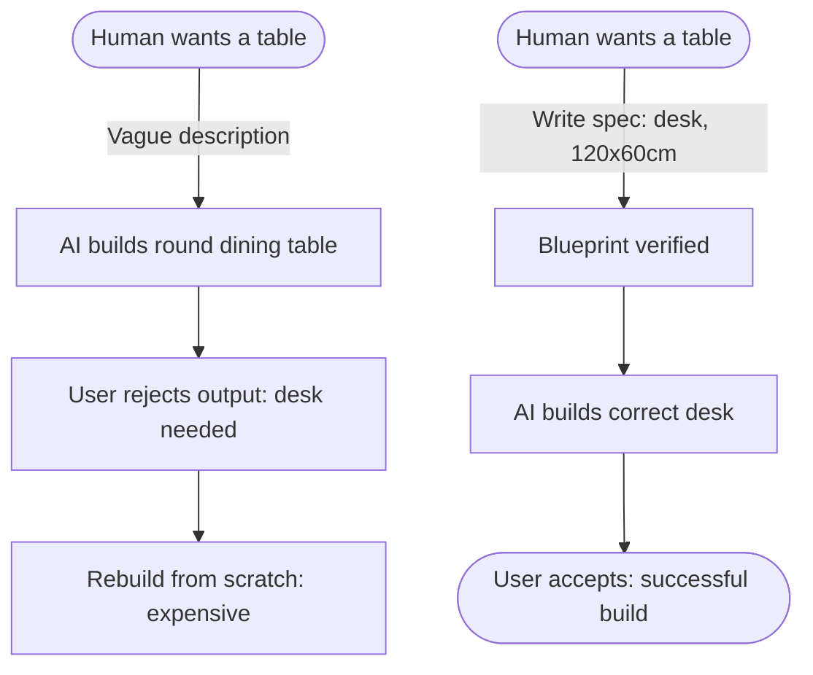

# Lesson 3: Problems Before Code

## 1. The Big Picture

Imagine you tell a carpenter: "Build me a table." The carpenter immediately starts cutting wood. Three days later, they deliver a beautiful, round oak dining table. 

But you needed a narrow, rectangular desk to fit against your bedroom wall. 

The table is structurally perfect, but it is a complete failure because the **requirements** were never defined. The carpenter started building before understanding the problem. In software, this results in millions of dollars wasted writing the wrong programs.

---

## 2. The Mental Model: The Spec Boundary

Picture a **boundary line** in the sand:

```text
[ Ambiguous / Human Intent ] ───( Spec Boundary )───► [ Precise Code / System Logic ]
```

On the left is human intent (vague, changing, vibes). On the right is code execution (strict, literal, binary). The **Specification (Spec)** is the bridge. It translates human desires into exact constraints that a computer (or an AI assistant) can execute without making assumptions.

---

## 3. Visual Thinking

Let's look at the mapping of a requirements mismatch flowchart:



By placing the blueprint step in the middle, we catch wrong directions before they cost time and energy.

---

## 4. Build Something: The "Ten No's" Audit

You are given a requirement: "We need to handle user profile picture uploads. Make it fast and handle errors gracefully."
1. Create a file named `profile_picture_spec.txt`.
2. Audit this requirement against ACDF's **Ten No's** (Lesson 1 Reference guide criteria):
   - What is the file size limit? (No undefined thresholds).
   - What image formats are allowed? (No vague edge cases).
   - What does "handle errors gracefully" mean if a user uploads a PDF?
3. Rewrite the requirement to resolve these gaps.

---

## 5. Hero Lens Reflection

How would our doctrines challenge the initial requirement?
* **Taylor (Value & Guardrails)**: Does uploading a profile picture actually move our primary JTBD? Can we use default avatars to ship the MVP faster?
* **Carlini (Adversarial Security)**: Profile uploads are highly dangerous. What if an attacker uploads a script disguised as a `.jpg`? How do we map the trust boundaries?
* **Schaad (UX Craftsman)**: What are the UI states? Where is the loading spinner? What does the empty state look like before a picture is uploaded?

---

## 6. Reflection Questions

1. Why are engineers tempted to start writing code before the specification is complete?
2. What is the danger of letting an AI assistant choose the file upload size limit for you?
3. How does the "Ten No's" checklist protect a beginner from making costly coding mistakes?
