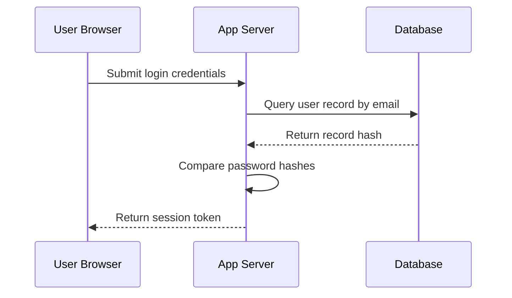

# Lesson 4: Thinking with Diagrams

## 1. The Big Picture

If you look at a 1,000-line codebase, it looks like a wall of text. Trying to understand how data moves through it by reading it line-by-line is like trying to understand a city's traffic grid by looking at a list of coordinate numbers.

A map makes the layout instantly clear. 

In ACDF, we use **Mermaid diagrams** to draw maps of our software. These diagrams are not decorative documentation; they are **executable mental models** that help you and your AI assistant agree on the system layout before writing any code.

---

## 2. The Mental Model: The System Map

Picture software as a **plumbing network**:

```text
  [ Tank A: User Input ] ──( Valve: Router )──► [ Tank B: Controller ] ──► [ Tank C: Database ]
```

* **Nodes (Tanks)**: Where data is stored or processed.
* **Edges (Pipes)**: The path data travels.
* **Valves**: The conditional logic that routes flow.

By visualizing the pipes, you can see where leaks (bugs), blocks (bottlenecks), or structural flaws occur before laying a single physical pipe.

---

## 3. Visual Thinking

Let's look at the mapping of a login request sequence diagram:



By reading this diagram from top to bottom, you can see every interaction. If the database returns "No record found", you can easily map the missing fallback path.

---

## 4. Build Something: Map a Real-World System

Choose a real-world system you use every day, such as a **library checkout counter** or an **ATM withdrawal**:
1. Create a file named `system_mapping.txt`.
2. Write down the sequence of steps:
   - What are the actors (e.g. Cardholder, ATM Screen, Bank Ledger)?
   - What message goes from who to whom? (e.g. Cardholder inputs PIN -> ATM Screen checks validity).
   - What is the state change? (e.g. Bank Ledger updates account balance).

---

## 5. Hero Lens Reflection

How would our doctrines challenge our system map?
* **Systems Builder (Cherny)**: Are the boundaries between the ATM screen and the Bank Ledger clear? Is there a direct database connection from the screen? (Warning: that violates decoupling zones!).
* **Security Red-Team (Carlini)**: Where is the security boundary? Does the ATM terminal cache the card's PIN? Is the network pipe encrypted?
* **Infrastructure Reliability**: What happens if the network pipe breaks *after* the cash is dispensed but *before* the bank ledger updates?

---

## 6. Reflection Questions

1. Why is it easier to find a logic error in a sequence diagram than in 500 lines of code?
2. How does drawing a diagram help you collaborate with an AI coding assistant?
3. What is the difference between a flowchart and a sequence diagram?
