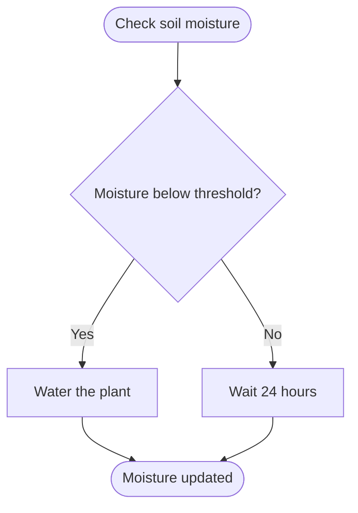

# Lesson 5: Your First Mermaid Diagram

## 1. The Big Picture

You don't need expensive drawing software to build architectural blueprints. 

ACDF uses **Mermaid**, a simple text-based tool that automatically converts plain-text lines into high-quality diagrams. This means you can type your model in markdown, and the system renders the graphic instantly. It keeps your code and blueprints in the same repository.

---

## 2. The Mental Model: Syntax to Shape

Picture text lines transforming into shapes:

* `[Square]` = Process or step.
* `([Rounded])` = Start or end point.
* `{"Diamond"}` = Decision split.
* `-->` = Arrow path.

```text
Type this:                         Get this:
A([Start]) --> B{Is it raining?}   [Start] ──► {Is it raining?}
```

---

## 3. Visual Thinking: Node and Edge Mapping

Let's read a simple flowchart mapping a plant watering decision engine:



By changing the text labels in the code, the shapes rearrange themselves automatically.

---

## 4. Build Something: Your First Flowchart

Create a file named `watering_system.mmd` and write the Mermaid code for the flowchart above. 
1. Open a browser and navigate to a Mermaid live editor (e.g. `mermaid.live`) or use your markdown rendering tool.
2. Paste the code.
3. Modify the flow: Add a check for "Is water reservoir empty?" before watering the plant. If the reservoir is empty, show a warning: "Sound Alarm".
4. Export the diagram or save the updated `.mmd` file in your workspace.

---

## 5. Hero Lens Reflection

How do our doctrines challenge this watering flowchart?
* **Simplicity (Karpathy)**: Is this the smallest useful version? Can we remove the alarm node for v0.1 and check manually?
* **Runtime Truth (Carmack)**: How is "moisture threshold" measured? Is it a voltage reading? Is the reading noisy? Do we need to average 10 samples to prevent false triggers?
* **Developer Ergonomics**: Can we run this flowchart logic locally in a terminal using mock sensor numbers to verify it compiles?

---

## 6. Reflection Questions

1. What did it feel like to see your text outline automatically transform into a diagram?
2. Why is Mermaid preferred over static PNG images for repository blueprints?
3. How does adding decision splits help you identify hidden assumptions?
