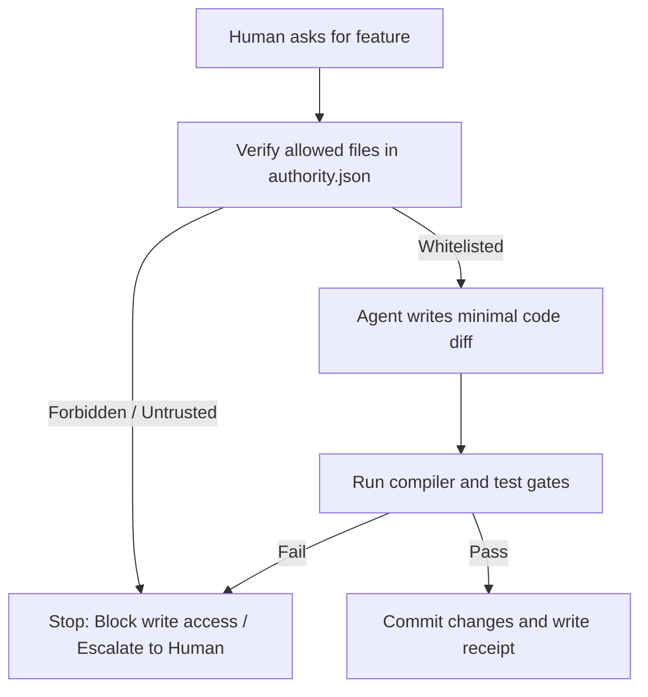

# Lesson 6: How AI Helps Engineers

## 1. The Big Picture

Imagine hiring an extremely fast apprentice. They can write 100 pages of text in 10 seconds, and they have read every textbook in the library. 

But they have no common sense. If you ask them to write a story about a character, they will confidently write a story where the character walks through walls, flies without wings, and forgets their own name by page 3, unless you guide them step by step.

This is a frontier AI model. 

AI coding assistants are highly capable implementers, but they are dangerous planners. If you give them unconstrained control over your codebase, they will confidently introduce code debt, bypass verification, and create regressions.

---

## 2. The Mental Model: The Governor and the Builder

Picture the team structure:

```text
                  [ Human Governor (Owns Judgment) ]
                                 │
                 ┌───────────────┴───────────────┐
                 ▼                               ▼
      [ AI Coding Agent ]              [ Gated Environment ]
      (Writes code diffs)             (Enforces constraints)
```

* **The Human (Governor)**: Holds the authority. Defines success, reviews models, curates knowledge, and makes strategic tradeoffs.
* **The AI (Builder)**: Suggests plans, implements minimal files within Whitelist bounds, and resolves unit errors.
* **The Gated OS (ACDF)**: Enforces verification, blocking the AI from making unapproved assumptions.

---

## 3. Visual Thinking: Bounded Execution

Let's read the ACDF containment flowchart:



This path contains the AI's actions. It blocks the builder from touching forbidden parts of the library.

---

## 4. Build Something: Write an AI Instruction Manifest

Create a file named `ai_rules.md`. Write down:
1. An explicit description of what files the AI is allowed to edit.
2. A list of 3 things the AI must *never* do without asking you first (e.g. deleting test lines, changing constants).
3. The exact terminal command the AI must run to verify its work.
4. How you will review the AI's output (what files will you inspect?).

---

## 5. Hero Lens Reflection

How do our doctrines critique the use of AI tools?
* **Willison (Empirical Skeptic)**: Never trust the AI's assertions. If the AI says "I successfully updated the database," force it to print the database records to console so you can see the evidence.
* **Lopopolo (AST & Harness)**: If an AI assistant introduces a bug, do not tell it to "be more careful" in a prompt. Add a compiler rule or a lint rule that programmatically blocks that bug from compiling.
* **Karpathy (Micro-Loop)**: Keep the leash short. Never ask the AI to build a massive feature at once. Decompose it into 10-line tasks.

---

## 6. Reflection Questions

1. Why does giving the AI complete write access to a repository result in technical debt?
2. What does "Humans govern, agents execute" mean to you?
3. How do binary gates protect the codebase when working with an AI apprentice?
