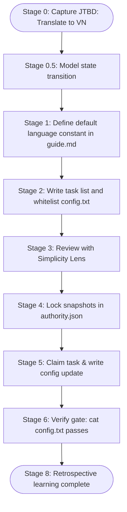

# Lesson 7: Your First ACDF Project

## 1. The Big Picture

Now we will put the pieces together. We will walk through a complete codebase change lifecycle. 

Instead of writing code directly, we will follow ACDF v9's stages. Our target task is simple: **Add a configuration setting that toggles the language of our application from English to Vietnamese.**

Even for this tiny task, we run the OS protocol to build habits of discipline.

---

## 2. The Mental Model: The Stage Escalation

Picture the stages as a **water filter**. Each layer catches larger particles (spec gaps, architecture flaws) before the clean water (code) reaches the bottom.

```text
[ Raw Brief ] ──► [ Stage 0: Explore ] ──► [ Stage 0.5: Model ] ──► [ Stage 4: Snapshot ] ──► [ Stage 5: Code ]
```

---

## 3. Visual Thinking

Let's look at the lifecycle pathway for our translation task:



---

## 4. Build Something: Run a Tiny ACDF Change

We will use the golden example in this repository to run a mock change:
1. Navigate to [examples/tiny-change/](../examples/tiny-change).
2. Look at the files:
   - `proposal.md`: What problem are we solving?
   - `models/architecture.mmd`: The Mermaid flow.
   - `tasks.md`: The whitelisted files and gates.
   - `authority.json`: The content-hashed snaps.
3. Pretend you are the agent: Edit `config.txt` inside that folder, changing `harmless_key=harmless_value` to `harmless_key=vietnamese`.
4. Run the gate verify check in your terminal:
   ```bash
   cat "/Users/alannguyen/Documents/Vibe Code/alan-coding-dark-factory/examples/tiny-change/config.txt"
   ```
5. Check if the outputs match. Write your task receipt inside `receipts/task-1.json`.

---

## 5. Hero Lens Reflection

How do our doctrines critique our tiny translation change?
* **Simplicity (Karpathy)**: Did we write the smallest possible diff? (Yes, only one line changed in `config.txt`).
* **Runtime Truth (Carmack)**: Does the application actually read this `config.txt` at boot? Run the system and check console logs.
* **Developer Ergonomics**: Is the deployment command documented in the runbook?

---

## 6. Reflection Questions

1. Why did we verify that `tasks.md` was completed before compiling the code?
2. What happens if you modify a file not whitelisted in the `authority.json` rules?
3. How did creating the task receipt help document your proof-of-work?
