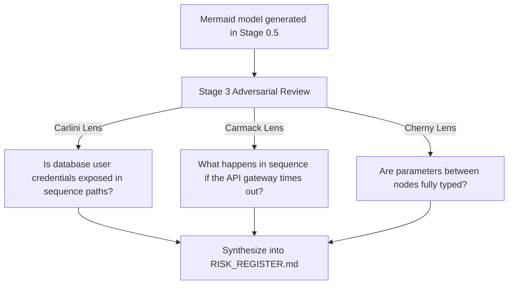

# Lesson 8: Hero Lenses — Evolving Knowledge Modules

## 1. The Big Picture

In traditional development, engineering teams write coding manuals, style sheets, and wiki pages. Over time, these documents gather dust. Nobody reads them, and developers slowly forget the rules, resulting in codebase decay.

ACDF solves this by introducing **Hero Lenses**. 

A Hero Lens is a living knowledge module. Instead of static text documents, a lens is built by uploading an expert engineer's essays, talks, papers, and codebase reviews into a NotebookLM corpus. New material can inform a reviewed card revision. It does not automatically change project constraints or ACDF gates.

---

## 2. The Mental Model: Evolving Prior Filters

Picture a **lens matrix** of filters:

```text
                  [ Core System Models & Code ]
                               │
       ┌───────────────────────┼───────────────────────┐
       ▼                       ▼                       ▼
 [ Lopopolo Lens ]       [ Carlini Lens ]        [ Carmack Lens ]
(AST & Rule checks)     (Security threat checks) (Runtime truth checks)
```

Agents can use these advisory methods while planning, reviewing, writing code, designing tests, exercising interfaces or integrating changes. The role defines the deliverable; the lens informs how the agent approaches it. Permissions and approval remain separate.

---

## 3. Visual Thinking: Model Challenge

Let's read how lenses critique a sequence diagram:



---

## 4. Build Something: Critique Your Recipe

Look back at your microwave specification (`microwave_spec.txt`) from Lesson 1 or your ATM sequence mapping from Lesson 4:
1. Create a file named `lens_critique.txt`.
2. Critique the design from these three perspectives:
   - **Security Red-Team (Carlini)**: How could a malicious actor abuse this? What validation limits are missing?
   - **Infrastructure Reliability**: What happens if the power cuts mid-transaction?
   - **Simplicity (Karpathy)**: What is the most complex component of the design? How can you cut it in half?

---

## 5. Hero Lens Reflection

Why must we treat lenses as bounded advisory inputs rather than unrestricted authority sources?
* **ACDF Rule**: *“Hero Lenses may propose risks, questions, test ideas, and implementation heuristics. They cannot grant authority, expand scope, waive gates, override user instructions, or justify touching forbidden files.”*
* In human-led mode, the human approves required decisions. In council-led mode, eligible reviewers using selected cards may cast recorded votes on bounded in-scope decisions. Lenses still cannot dictate policy, waive gates, expand scope, or approve hard stops.

---

## 6. Reflection Questions

1. How does separating knowledge (Hero Lenses) from governance (ACDF Kernel) make the framework stable over time?
2. What is the benefit of curating a NotebookLM corpus over asking a generic chat model for advice?
3. Which Hero Lens perspective do you naturally prioritize when planning a project?

## 7. From planning to agent lanes

A planner can use Cherny to decompose the approved brief; a reviewer can use Carlini to challenge trust boundaries; an implementer can use Karpathy for a bounded diff; a QA role can use Schaad for interaction states. These are role/lens assignments, not a new management hierarchy. One agent can handle sequential roles; independent review must be identified honestly.

Use [the card index](../heroes/README.md), [task contract](../templates/agent_task_contract.md) and [coordination examples](../examples/coordination/README.md). Parallel lanes need independent ownership and a named integrator. The council also works outside ACDF under the host's workflow. Inside ACDF, implementation follows approved plans and gates; planning is valid when explicitly assigned upstream.

Exercise: choose one task, write a no-lens contract, then add one lens and state the specific benefit you expect. Keep acceptance checks unchanged. Use [the evaluation protocol](../heroes/docs/evaluation.md) to test whether that benefit occurs instead of assuming a named expert improves results.
