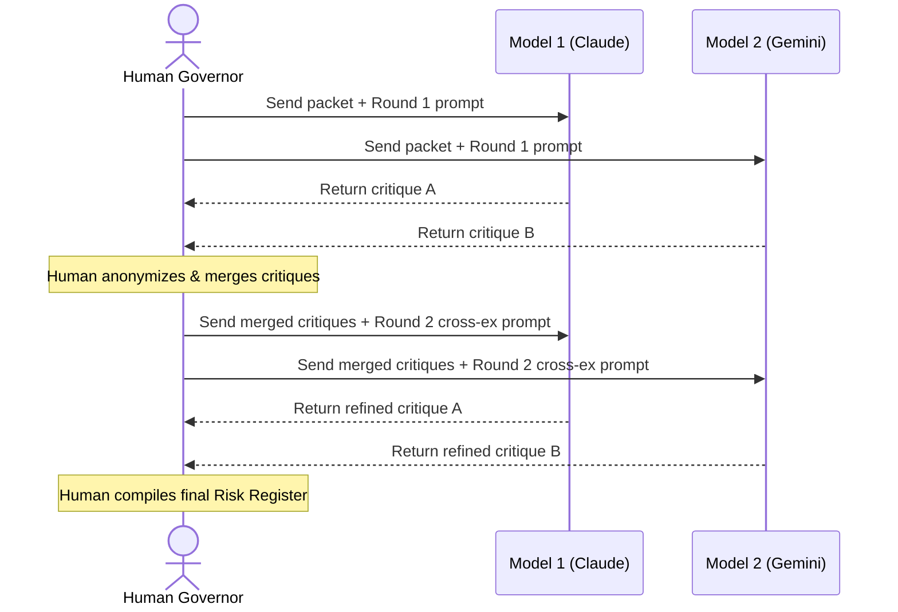

# Lesson 9: Multi-Model Adversarial Review

## 1. The Big Picture

If you ask a single person to critique your house design, they might notice a few issues. But if you gather three different architects in separate rooms, ask them to critique your design independently, and then get them to challenge each other's opinions, you will uncover hidden structural flaws you never could have anticipated.

In ACDF, we do the exact same thing using AI. 

We do not trust a single model's planning. Instead, ACDF orchestrates multiple distinct frontier models across three blind rounds of critique, cross-examination, and risk synthesis. The user chooses human-led approval or bounded Council-led approval for routine decisions.

---

## 2. The Mental Model: Blind Cross-Examination

Picture the review flow:

```text
                  [ Human Governor (Prepares Packet) ]
                                  │
         ┌────────────────────────┼────────────────────────┐
         ▼                        ▼                        ▼
  [ Model A (Claude) ]     [ Model B (Gemini) ]     [ Model C (GPT) ]
       (Blind R1)               (Blind R1)               (Blind R1)
         │                        │                        │
         └────────────────────────┼────────────────────────┘
                                  ▼
                    [ Human Merges Objections ]
                                  │
         ┌────────────────────────┼────────────────────────┐
         ▼                        ▼                        ▼
     [ Model A ]              [ Model B ]              [ Model C ]
    (Cross-Ex R2)            (Cross-Ex R2)            (Cross-Ex R2)
         │                        │                        │
         └────────────────────────┼────────────────────────┘
                                  ▼
                   [ Final Synthesized Risk Register ]
```

By preventing models from communicating during Round 1, we prevent them from agreeing too early, ensuring independent reasoning paths.

---

## 3. Visual Thinking

Let's trace how the human manages this sequence:



---

## 4. Build Something: Run a Two-Model Blind Review

Let's simulate a two-model review locally using your microwave specification (`microwave_spec.txt`) from Lesson 1:
1. Copy the contents of `microwave_spec.txt`.
2. Open your first AI model tool (e.g. Model A) and paste the spec with the prompt: *"Critique this microwave specification. Identify the top 3 safety risks."* Save the output as `critique_a.md`.
3. Open your second AI model tool (e.g. Model B) and paste the spec with the same prompt. Save as `critique_b.md`.
4. Merge the critiques into a file named `merged_objections.txt`. 
5. Send `merged_objections.txt` to Model A and ask: *"Which of these objections are strongest, and how should we update our specification to resolve them?"*
6. Update your microwave spec file using the final recommendation.

---

## 5. Hero Lens Reflection

How do our doctrines govern this multi-model process?
* **Cherny (Type-Driven Orchestrator)**: Never run the models in a single long conversation. Keep their context windows clean and separated to prevent them from copying each other's assumptions.
* **Carlini (Adversarial Reductionist)**: Do not average away minority warnings. If only one model flags a high-severity security risk, keep it as a blocker.
* **Willison (Empirical Skeptic)**: Convert the final risk register items into concrete test commands in your task file.

---

## 6. Reflection Questions

1. Why do we prevent the models from seeing each other's outputs in Round 1?
2. Did the two models identify different risks in your microwave spec? Why?
3. How does this process shift your role from a coder to a governor?
