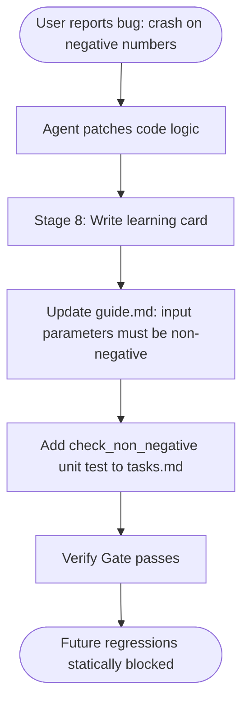

# Lesson 10: Building Real Projects

## 1. The Big Picture

Now that you understand software inputs, decomposition, visual modeling, and multi-model reviews, you are ready to scale up. 

When you build real projects, you will make mistakes. Code will crash, models will hallucinate, and requirements will change. A master systems engineer is not someone who never makes mistakes; it is someone who builds **preventative systems** so that the same mistake never happens twice. 

This is the goal of **Stage 8 (Retrospective)**: translating failures into static invariants in your project's Reference Guide.

---

## 2. The Mental Model: The Prevention Loop

Picture the feedback loop:

```text
  [ Error Occurs ] ──► [ Patch Symptom ] ──► [ Extract Root Cause ] ──► [ Append Spec Rule ]
                                                                                │
  [ No Future Regression ] ◄── [ Automated Gate Enforces Spec Rule ] ◄──────────┘
```

When a bug escapes into production, it means your verification filter had a gap. You don't just patch the code; you patch the filter.

---

## 3. Visual Thinking: Feedback Loop

Let's read the lifecycle progression of an escaped bug:



By formalizing the rule, we prevent future models or developers from re-introducing the bug.

---

## 4. Build Something: Write a Learning Card

You are building an app, and it crashes because a user typed a special character (like `#` or `@`) in their username, which broke the database query.
1. Create a file named `learning_card.txt`.
2. Write down:
   - **The Symptom**: What failed?
   - **The Root Cause**: Why did the verification filter fail to catch this?
   - **The Prevention Rule**: What rule should be added to the project's Reference Guide to block this permanently?
   - **The Gate Command**: What exact terminal command or validator check will enforce this rule going forward?

---

## 5. Hero Lens Reflection

How do our doctrines critique our learning card?
* **Carmack (Runtime Truth)**: Don't just assert the rule. Write a test case containing a list of 20 special characters, run it, and log the outputs to prove they are rejected.
* **Lopopolo (Harness Master)**: Integrate the validation test into the pre-commit script so it runs in under one second on every change.
* **Taylor (Product Judgment)**: How does this validation rule affect user friction? Can we display a clear helper message in the UI so users know which characters are allowed?

---

## 6. Reflection Questions

1. Why is patching the specification filter more valuable than patching the code symptom?
2. How does building a prevention loop change your attitude toward failures and bugs?
3. What is the danger of letting a project's Reference Guide grow without automated validation?
