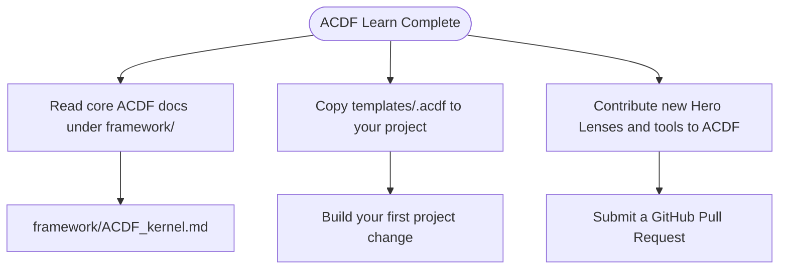

# Lesson 11: Next Steps

## 1. The Big Picture

Congratulations! You have completed the **ACDF Learn** curriculum. 

You now understand:
1. Software as inputs, state, and outputs.
2. Decomposition of complex requirements into structured steps.
3. System mapping and executable modeling using Mermaid.
4. Orchestrating multi-model adversarial reviews.
5. Establishing containment gates and feedback loops.

You have transitioned from writing unconstrained code to governing software development. You are ready to build real systems.

---

## 2. The Mental Model: Evolving from Builder to Architect

Picture your progression:

```text
  [ Beginner: Code autocomplete ] ──► [ Developer: Manual testing ] ──► [ Architect: ACDF OS Governance ]
```

---

## 3. Visual Thinking: Workspace Map

Let's read your navigation map to proceed in the ACDF ecosystem:



---

## 4. Build Something: Initialize Your First Project

Let's start your first real-world governed project:
1. Create a new directory named `my_governed_app` on your computer.
2. Initialize Git in that directory: `git init`.
3. Copy ACDF's templates:
   ```bash
   cp -r "/Users/alannguyen/Documents/Vibe Code/alan-coding-dark-factory/templates/.acdf" ./
   ```
4. Create your first specification: Open `.acdf/reference/guide.md` and define the inputs and state for your new project.
5. Stage and commit the directory structure: `git add . && git commit -m "Initialize ACDF OS"`.

---

## 5. Hero Lens Reflection

How do our doctrines challenge your first project setup?
* **Hashimoto (Hammer Maker)**: Can you build a single `setup.sh` or `Makefile` script that boots this new workspace in one command?
* **Willison (Empirical Skeptic)**: Have you defined the boundaries and whitelisted files in `authority.json` to lock down future agent operations?
* **Taylor (Product Judgment)**: What is the core metric you want to measure to prove this project succeeds?

---

## 6. Reflection Questions

1. How has your perspective on AI coding assistants changed since Lesson 1?
2. What project are you going to build first using the ACDF operating system?
3. How will you curate and build your first custom NotebookLM Hero Lens?
