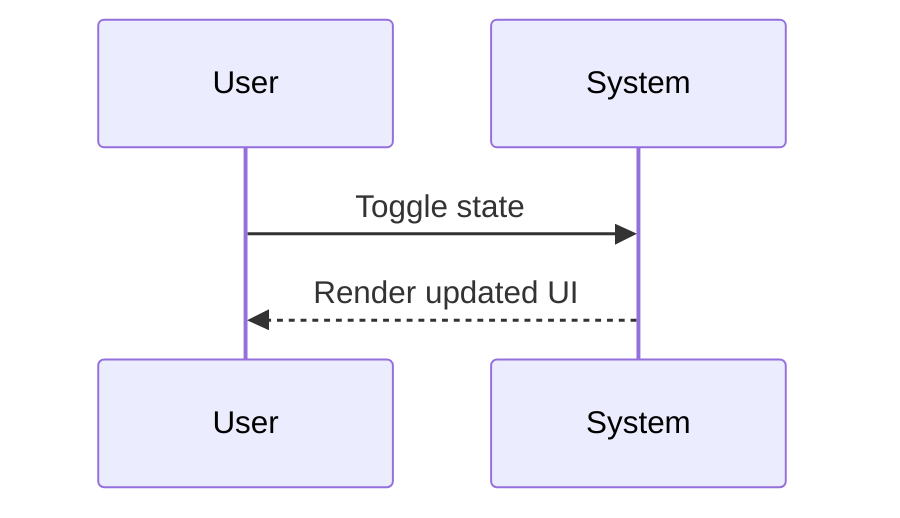

# Technical Design: [Change Name]

- **Architecture Type**: [Microservice / Component / Integration]
- **Reference Contract Referenced**: [Path to core specifications]

---

## 1. System Components & Interfaces

Define any new data models, type definitions, or schema extensions:

```typescript
// Proposed types/interfaces
```

---

## 2. Execution Sequences

Map data flow sequence transitions:


